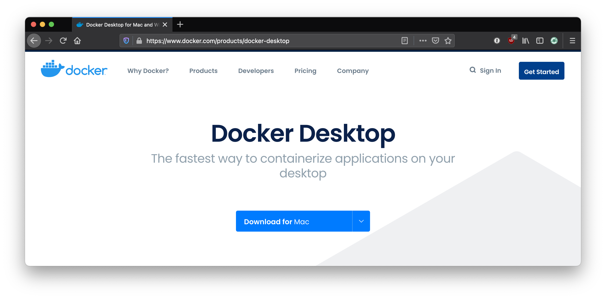
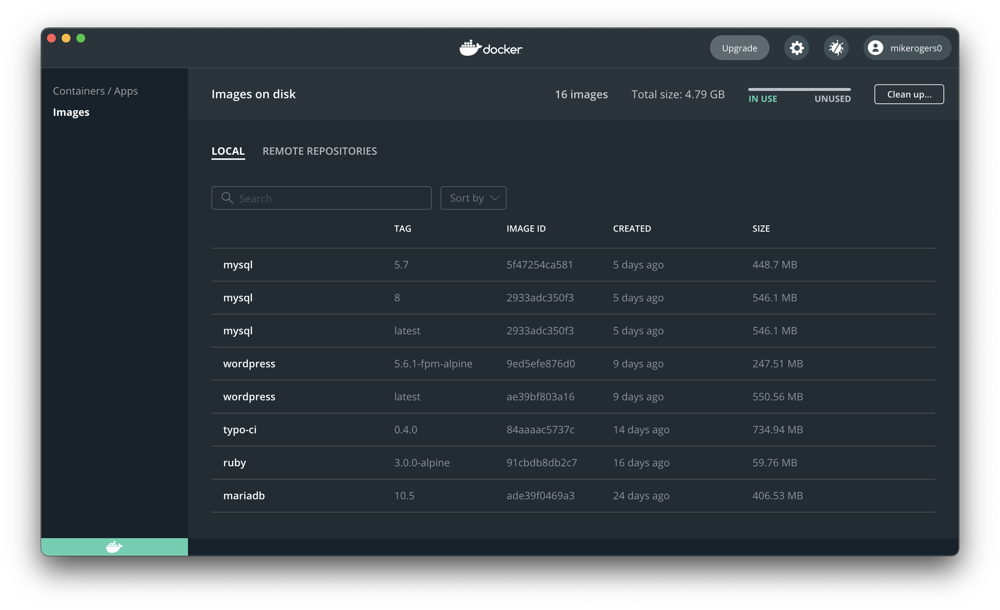

<!-- _class: lead -->
<!--
Hi I'm Mike Rogers, I'm a Ruby Developer from the UK!

I really like Docker! It makes me very happy, as

Docker solved a lot of my developer woes & I want to share it with everyone!
-->

# Docker For Developer Happiness

What is Docker & what does it solve?

---

<!--
I'm going to give you an introduction to what Docker is.

The aim of this talk is to give you enough confidence to know what on earth it is, and hopefully give it a try.
-->

# What are we going to cover?

- What are we trying to solve?
- What is Docker?
- How do we use Docker?
- Docker Compose makes it easier!
- What are the drawbacks?

---

<!-- _class: lead -->
<!--
Seriously! Why am I telling you about this?
I like to make sure you know why I think this solves problems.

I'm going to go through some development scenarios where I think Docker would have helped.
-->

# What are we trying to solve?

---

<!-- _class: lead -->
<!--
This is a true story!

I worked on a product where every developer install the database tool we used (Postgres) at different times & as a result we all were running different versions.

One day we had a developer use a new SQL function which solved our problems really well. We got to production & it didn't work.

Had we been using Docker, we could have say "Everyone use the same Postgres version as Production".

Plus it would have kicked us into get around updating our postgres version.
-->

# What are we trying to solve?

🧑‍💻 I'm running Postgres 13

👩‍💻 I'm running Postgres 12

☁️  Jokes on you! I'm still running Postgres 10

---

<!-- _class: lead -->
<!--
Another true story!

Have you ever picked up a legacy project which had a bunch of steps to get started?

Installing some of those packages is hard! Sometimes they throw cryptic errors due to MacOS (Or the OS) changing something.

Even worse, what if you end up with a random dependency from that project which screws with another project. It's all really messy.

I totally hide in the toilet as a junior dev when I couldn't get an app setup on my machine & I didn't want to ask for help.

With Docker, we can setup our apps with very few commands and depending on how it's setup you might not even need to look at terminal.
-->

# What are we trying to solve?

🧑‍💻 It's my first day! Why isn't the app starting?

👩‍💻 Just install all the packages listed in the README

📘 README: _Wildly out of date_

---

<!-- _class: lead -->
<!--
This is my big fear!

Someone has a project & I don't know how to turn it on.

With docker, we can make it so how we setup & run our projects pretty much the same.

With Docker you're creating a "little box", with everything your app needs to run in that box. Once you're done, you can throw the box away.
-->

# What are we trying to solve?

👩‍💻 We need a small change on an old COBOL project!

🧑‍💻 How do I turn this on & see it works?

---

<!-- _class: lead -->
<!--
Seriously what is it?

This is kind of simplistic definition, but works.
-->

# What is Docker?

Software to build, download & run lots of little virtual computers on you computer.

---

<!--
Here are some other definitions I'll be using!

We build images, we run them in a container.

Image: It's like a snapshot of a computers disc drive at a point in time, which we start our app at. Kind of like if you have Git version control looking at an entire Disc.

Container: Runs the image

Alpine Linux: Most images start with Alpine as their base image

Don't worry if this terminology seems weird.
-->

# What is Docker?

📖 Terminology!

- **Image:** A Docker image is a read-only template used to build containers. Images are used to store and ship applications.
- **Container:** A Docker container is a standardized, encapsulated environment that runs applications.
- **Alpine Linux:** Alpine Linux is a security-oriented, lightweight Linux distribution 🐧

---

<!-- _class: lead -->
<!--
What are the steps to get going & how do you get the benefits!
-->

# How do we use Docker?

---

<!--
First off, you need to download it
-->

# How do we use Docker?

<div class="center-contents">
  
</div>

---

<!--
This will give you the desktop app
-->

# How do we use Docker?

<div class="center-contents">
  
</div>

---

<!--
After this point you'll have access to docker & all of it's commands in terminal.
-->

# How do we use Docker?

```bash{0}
$ docker help

Usage:  docker [OPTIONS] COMMAND

A self-sufficient runtime for containers

Options:
      --config string      Location of client config files (default "/Users/mike/.docker")
  -c, --context string     Name of the context to use to connect to the daemon (overrides DOCKER_HOST env var and default context set with "docker context use")
  -D, --debug              Enable debug mode
  -H, --host list          Daemon socket(s) to connect to
```

---

<!--
So if you wanted to run Ruby without installing you, could run this command,

It'll download image to run ruby, then you'll get a little ruby console to run commands.

Plus after I'm done with it, it'll go back to it's original state. So I can make a total mess & it'll be fine.

All running in a little sub computer! This I think is pretty powerful!
-->

# How do we use Docker?

```bash{0}
$ docker run --rm -it ruby:3.0.0-alpine
irb(main):001:0* [1,2,3,4].sum
=> 10
irb(main):002:0> 
```

---

<!--
What if we want to create an image, which has a few packages installing with out app there.

We can go to our project root, add a Dockerfile.

You can kind of reason what it might do here! Like, we're going to install yarn & copy the files, bundle then make it so it turns on
-->

# How do we use Docker?

```dockerfile{0}
# Dockerfile
FROM ruby:3.0.0-alpine
RUN apk --no-cache add --virtual build-dependencies build-base yarn

RUN mkdir -p /usr/src/app
WORKDIR /usr/src/app
COPY . /usr/src/app

# Install Gems & NPM Packages
RUN bundle install && yarn install --check-files

EXPOSE 3000
CMD ["rails", "server", "-b", "0.0.0.0", "-p", "3000"]
```

---

<!--
Then you can totally build that image & run it! Which is super cool!

You can push that image up & share it with people, it's almost job done!

So you could make a little CLI application in any language you want, and share it with your mate & they can run it.

They just have to download that image
-->

# How do we use Docker?

```bash{0}
# Build the Dockerfile
$ docker build --tag local/my-app:latest .

# Run the image locally
$ docker run --rm -it local/my-app:latest

# Push it to Docker Hub to share it
$ docker push local/my-app:latest

# Pull down from Docker Hub
$ docker pull local/my-app:latest
```

---

<!-- _class: lead -->
<!--
After i built a few docker files, i wanted to find a way to manage more of my app!

docker-compose was the answer. it's installed along with the other `docker` command, it should be there.
-->

# Docker Compose makes it easier!

https://docs.docker.com/compose/

```bash{0}
$ docker-compose up
```

---

<!--
With Docker-compose, you setup a YAML file called docker-compose.yml which kind of just says:

"here are the things my app needs to run & some configuration". In this case, I've asked for a specific version of Postgres.
-->

```yaml{6,11,13}
# docker-compose.yml
version: "3.8"

services:
  postgres:
    image: postgres:12.3-alpine
    volumes:
      - ./tmp/db:/var/lib/postgresql/data

  web:
    build: .
    volumes:
      - .:/usr/src/app
    ports:
      - "3000:3000"
    depends_on:
      - postgres
```

---

<!--
Here is my setup if I was to do WordPress.

I don't need to setup PHP, or download any Wordpress files. I just need a wp-content folder.
-->

```yaml{6,11,13}
# wordpress/docker-compose.yml
version: "3.8"

services:
   mysql:
     image: mysql:latest
     volumes:
       - ./mysql-data:/var/lib/mysql

   wordpress:
     image: wordpress:latest
     volumes:
       - ./wp-content:/var/www/html/wp-content
     ports:
       - "127.0.0.1:8888:80"
     depends_on:
       - mysql
```

---

<!--
From there, can run this docker-compose up command & it'll just turn on everything we need.

It'll even build the image if it needs to. So potentially the only setup notes you need in a project is "run with docker-compose up"
-->

# Docker Compose makes it easier!

```bash{0}
$ docker-compose up

Starting app_postgres_1 ... done
Starting app_web_1      ... done
Attaching to app_web_1
web_1        | => Booting Puma
web_1        | => Rails 6.0.3.4 application starting in development 
web_1        | => Run `rails server --help` for more startup options
web_1        | Puma starting in single mode...
web_1        | * Listening on tcp://0.0.0.0:3000
web_1        | Use Ctrl-C to stop
```

---

<!--
I can also go in & run adhoc commands.

This is really cool!
-->

# Docker Compose makes it easier!

```bash{0}
$ docker-compose run --rm web bash

Creating app_web_run ... done
bash-5.1$ 
```

```bash{0}
$ docker-compose run --rm web bundle exec rails c

Creating app_web_run ... done
Loading development environment (Rails 6.1.1)
irb(main):001:0> 
```

---

<!--
I can also just run on the services I care about.

So sometimes I just turn on my database, then run my rails app via my local machine.
-->

# Docker Compose makes it easier!

```bash{0}
$ docker-compose up postgres

Starting app_postgres_1 ... done
```

---

<!-- _class: lead -->

<!--
There are some!
-->

# What are the drawbacks?

---

<!--
It's a bit of a resource hog on MacOS, it's better on Ubuntu.

Machine within machine will be slower.

You can delete the images, but they do add up.
-->

# What are the drawbacks?

- High memory usage on MacOS
- It is a machine with your machine, so it isn't as fast as running natively
- The images uses a lot of disc space

---

<!--
I also like this quote from Nicky T!

I was watching him on a stream debug a Docker issue & he dropped it.

It's not a silver bullet, you can still get some quirks slipping through & some people use it in different ways.
-->

# What are the drawbacks?

> Works on my Docker

Nick Taylor ( @nickytonline )

---

<!-- _class: lead -->

<!--
Breath & tell them your name!

I hope this inspired you to want to try Docker!
-->

# Thank you

Twitter: @MikeRogers0

Blog: [mikerogers.io](https://mikerogers.io/)
