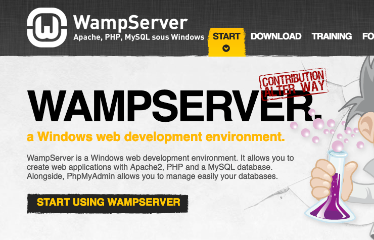
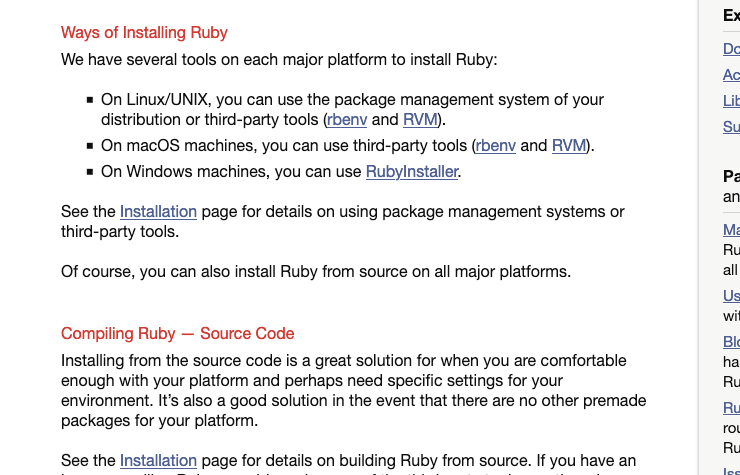
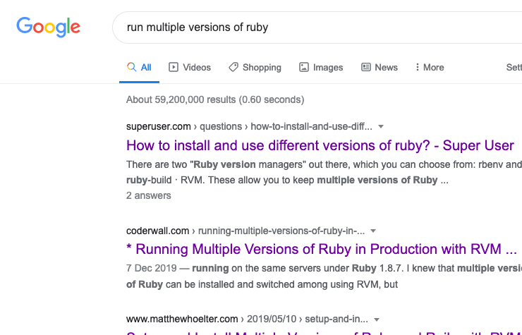
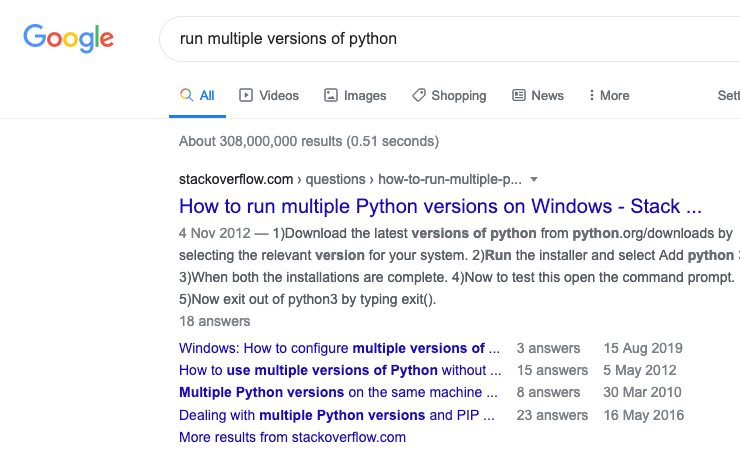
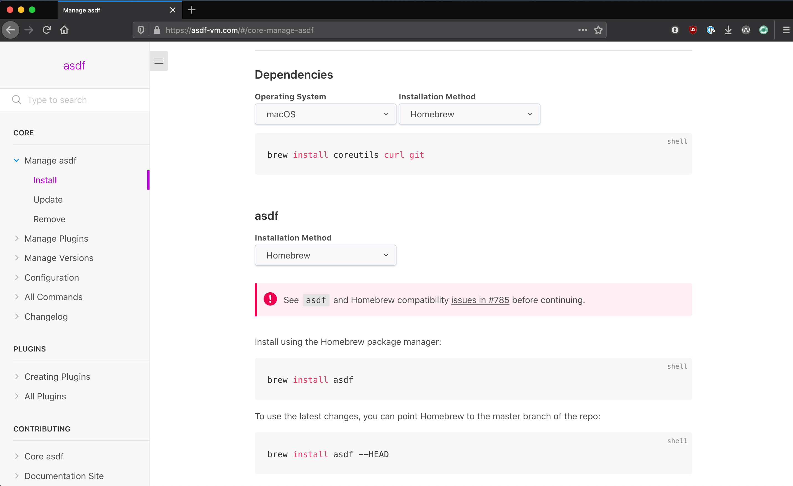

<!-- _class: lead -->
<!--
Hi! I'm Mike!!

I'm going to talk about making it easier to install & switch between languages.
-->

# Installing Multiple Languages

Lets install & use multiple languages!

---
<!-- _class: lead -->
<!--
I like to mess around with different languages, especially on Exercism channel.

It's fun to install a new language one weekend & play about!

But out the box, installing languages is kind of tricky.
-->

# Where does this come from?

I like to try lots of languages, but I also don't want to break my work machine.

---
<!-- _class: lead -->
<!--
Question for the crowd!

(Wait for responses)

Do you remember? Was it a good experience?

I messed up installing languages, and had Software Update breaking everything.
-->

# Question

How do does everyone install their favourite programming language right now?

---
<!--
When I first started in dev, I used WAMP!

I remember just clicking "next" on an installer, then I just I just had like everything I needed.

I don't remember it ever telling me what version numbers I installer, but it was so cool!
-->

# My Experiences So Far

<center class="center-contents mt-4">
  
</center>

---
<!--
Now I do Ruby a lot...I don't think there is a _right way_ to install it 🤫

On their website it gives like a few choices...
-->

# My Experiences So Far

<center class="center-contents mt-4">
  
</center>

---
<!--
If you want to run different versions of ruby,

There are 59 million pages telling you slightly different ways to do it.
-->

# My Experiences So Far

<center class="center-contents mt-4">
  
</center>

---
<!--
Though other languages have the same issue.
-->

# My Experiences So Far

<center class="center-contents mt-4">
  
</center>

---
<!-- _class: lead -->
<!--
I just want installing a language to be easy!
-->

# What I want

Something which lets me install all the things, without having a big adventure each time.

---
<!-- _class: lead -->
<!--

I started using this tool a few months ago & really liked it.

asdf: It's a bit like homebrew, if anyone has used that.

You can install a bunch of languages, but it was also designed to make switching between language versions easier.

E.g. You want to run the latest Ruby on one project, but on another project it's running an older version. It just kind of handles it.
-->

# I like asdf

It can be used to install Node.js, Python, Ruby, Elixir, kubectl, Redis - Pretty much everything developers use!

https://asdf-vm.com/

---
<!--
It has a really super install page, where you can put in your setup & it'll give you tailored install instructions.

I liked that! Super awesome!
-->

# Installing asdf

<center class="center-contents mt-4">
  
</center>

---
<!--
Once you have asdf setup, 

It's approachable to get a new language setup.
-->

# Installing a Language

```bash{0}
# Setup Ruby
$ asdf plugin add ruby

# Install Latest Ruby Version:
$ asdf install ruby 2.7.2
$ asdf global ruby 2.7.2

# Did it work?
$ ruby -v
ruby 2.7.2p137 (2020-10-01 revision 5445e04352) [x86_64-darwin19]
```

---
<!--
The "plugin add" line is saying "give me the resources to install ruby".

Behind the scenes it has a neat plugin architecture which lets anyone create a way to install plugins.

So if someone was to release something new you could get access to it pretty fast.
-->

# Installing a Language

```bash{2}
# Setup Ruby
$ asdf plugin add ruby

# Install Latest Ruby Version:
$ asdf install ruby 2.7.2
$ asdf global ruby 2.7.2

# Did it work?
$ ruby -v
ruby 2.7.2p137 (2020-10-01 revision 5445e04352) [x86_64-darwin19]
```

---
<!--
Then the next two commands are:

- Lets install this version of ruby
- Lets use this version of ruby globally (The default version), so when nothing else is set.
-->

# Installing a Language

```bash{5,6}
# Setup Ruby
$ asdf plugin add ruby

# Install Latest Ruby Version:
$ asdf install ruby 2.7.2
$ asdf global ruby 2.7.2

# Did it work?
$ ruby -v
ruby 2.7.2p137 (2020-10-01 revision 5445e04352) [x86_64-darwin19]
```

---
<!--
You might have to open a new tab.

Then once that's done, you can start running ruby commands.
-->

# Installing a Language

```bash{9,10}
# Setup Ruby
$ asdf plugin add ruby

# Install Latest Ruby Version:
$ asdf install ruby 2.7.2
$ asdf global ruby 2.7.2

# Did it work?
$ ruby -v
ruby 2.7.2p137 (2020-10-01 revision 5445e04352) [x86_64-darwin19]
```

---
<!--
To install python, it's similar
-->

# Installing a Language

```bash{0}
# Setup Python
$ asdf plugin add python

# Install Latest Python Version:
$ asdf install python 3.9.0
$ asdf global python 3.9.0

# Did it work?
$ python --version
Python 3.9.0
```

---
<!--
To install same with yarn

I think that's really nice!
-->

# Installing a Language

```bash{0}
# Setup Yarn
$ asdf plugin add yarn

# Install Latest Yarn Version:
$ asdf install yarn 1.22.10
$ asdf global yarn 1.22.10

# Did it work?
$ yarn -v
1.22.10
```

---
<!-- _class: lead -->
<!--
Pretty often you'll probably have to run multiple versions of a tool. Here is how you do it!
-->

# Different Versions Per Project

What if you have different projects running different versions of languages?

---

<!--
I mentioned it's good for managing multiple versions of languages.

Within a projects folder you can run a command which pretty much says:

"Everything under this folder, run this version of this language"

And it'll create a `.tool-versions` to keep track of what you chose, everything under it will use what's defined in the file.

Assuming you've got that version installed, it'll just work.
-->

# Different Versions Per Project

```bash{3,4}
$ cd ~/Old_Project

$ asdf local ruby 2.7.2
$ asdf local python 3.9.0

$ cat .tool-versions
ruby 2.7.2
python 3.9.0
```

---

<!--
If you don't have it right installed you can run the "asdf install" command, and it'll make sure you've got the right version installed.

This is super hand for if you're working in a team & that `.tool-version` file is in version control.
-->

# Different Versions Per Project

```bash{5}
$ git clone git@github.com:MikeRogers0/Old_Project.git
$ cd Old_Project

# Make sure we have the right versions installed
$ asdf install
python 3.9.0 is already installed
ruby 2.7.2 is already installed

$ python --version
Python 3.9.0
```

---

<!--
If you do ever get stuck, they have a super good help command.
-->

# If You Need Help

```bash{1}
$ asdf help
version: v0.8.0

MANAGE PLUGINS
asdf plugin add <name> [<git-url>]      Add a plugin from the plugin repo OR,
                                        add a Git repo as a plugin by
                                        specifying the name and repo url
asdf plugin list [--urls] [--refs]      List installed plugins. Optionally show
                                        git urls and git-ref
asdf plugin list all                    List plugins registered on asdf-plugins
                                        repository with URLs
asdf plugin remove <name>               Remove plugin and package versions
```

---
<!-- _class: lead -->
<!--
You made it! BREATH!

Hopefully that gave you enough feel like you can totally go try new languages without to many walls.

If you have questions, ping me on Slack or on Twitter :)
-->

# 🎉 That's all 🎉

Twitter: @MikeRogers0
