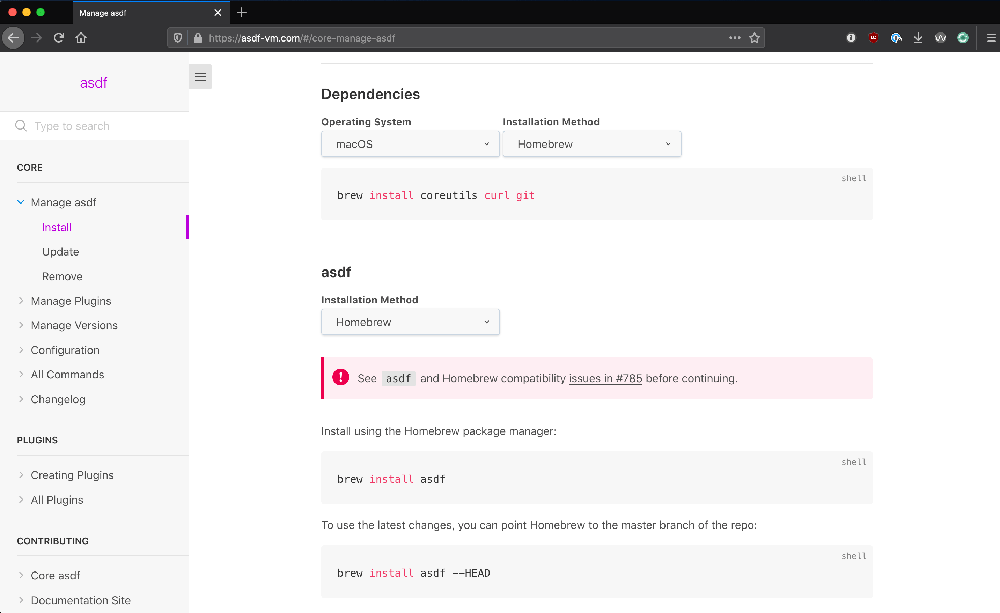

<!-- _class: lead -->
<!--
Hi! I'm Mike!!

I'm going to talk about making it easier to install & switch between languages.
-->

# Developing in Multiple Languages

Make it easier to install & use multiple languages!

---
<!-- _class: lead -->
<!--
I like to try out lots of different languages, especially on Exercism channel.

It's fun to install a new language one weekend & play about, but I also don't want to have to jump through hoops when trying old stuff.
-->

# Where does this come from?

I want to try lots of languages, and have everything still work when I change project.

---
<!-- _class: lead -->
<!--
Question for the crowd!

I do Ruby...I still don't know the _right way_ to install it 🤫

I messed up installing languages, or a Software Update breaks everything for me.
-->

# Question

How do does everyone install their favourite programming language right now?

---
<!-- _class: lead -->
<!--

I started using this tool a few months ago & really liked it.

asdf: It's a bit like homebrew, if anyone has used that.

You can install a bunch of languages, but it was also designed to make switching between language versions easier.

E.g. You want to run the latest Ruby on one project, but on another project it's running an older version. It just kind of handles it.

But what I really like about it is not to many command to learn.
-->

# asdf

It can be used to install Node.js, Python, Ruby, Elixir, Elm - Pretty much everything!

https://asdf-vm.com/#/

---
<!--
It has a really super install page, where you can put in your setup & it'll give you tailored install instructions. 
-->

# asdf - Installing

<center class="center-contents">
  
</center>

---
<!--
Once you have asdf setup, the commands to install a language are pretty approachable also.

The "plugin add" line is saying "Let me install ruby", behind the scenes it has a neat plugin architecture which lets anyone create a way to install plugins. So if someone was to release something new you could get access to it pretty fast.

Then the next two commands are:

- Lets install ruby
- Lets use this version of ruby globally (The default version), so when nothing else is set.

Then once that's done, you can start running ruby commands.
-->

# asdf - Installing a Language

```bash{0}
# Setup Ruby
$ asdf plugin add ruby

# Install Latest Ruby Version:
$ asdf install ruby 2.7.2
$ asdf global ruby 2.7.2

# Did it work?
$ ruby -v
ruby 2.7.2p137 (2020-10-01 revision 5445e04352) [x86_64-darwin19]
```

---
<!--
To install python, it's similar

I think that's really nice!
-->

# asdf - Installing a Language

```bash{0}
# Setup Python
$ asdf plugin add python

# Install Latest Python Version:
$ asdf install python 3.9.0
$ asdf global python 3.9.0

# Did it work?
$ python --version
Python 3.9.0
```

---

<!--

I mentioned it's good for managing multiple versions of languages.

So within a folder, you'd just run this command and if you've got the version number installed it'll just start using the different version.

It'll create a `.tool-versions` file for each folders, everything under it will be
set to what you set here.

I've been using asdf a lot to play with exercisms lately.
-->

# asdf - Setting version per project

```bash{0}
$ cd ~/Old_Project

$ asdf local ruby 2.7.2
$ asdf local python 3.9.0

$ cat .tool-versions
ruby 2.7.2
python 3.9.0
```

---
<!--
Plus it's not like messing your with system, it's just putting files in a dot folder. Which I quite like.
-->

# asdf - Setting version per project

Once you're up and going, you'll notice when you type the python command it's actually coming from the `.asdf` folder.

```bash{0}
$ which python
/Users/mike/.asdf/shims/python

$ asdf which python
/Users/mike/.asdf/installs/ruby/3.9.0/bin/python

$ python --version
Python 3.9.0
```
