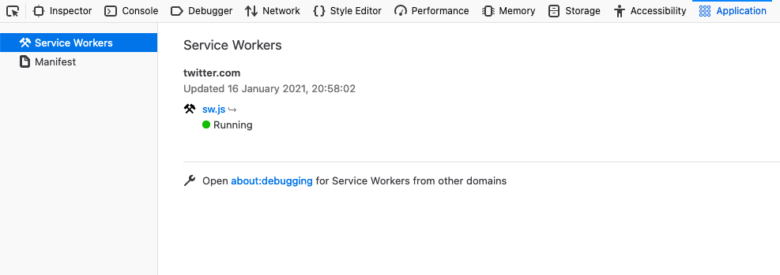
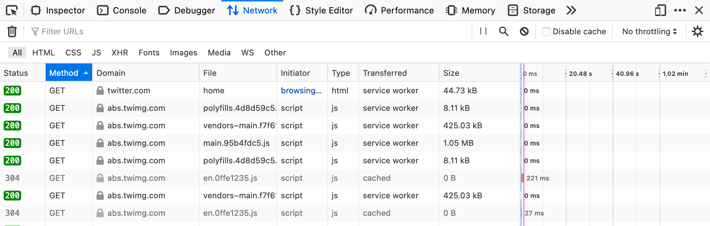

<!-- _class: lead -->
<!--
This started off as a "I've seen a few sites with offline fallbacks, how easy is it in rails" experiment.

I ended up quite liking the results & wanted to share them!
-->

# Taking Rails Offline

How to make your Ruby on Rails apps resilient to unreliable networks & also improve app performance a bit better.

---
<!--
This is my plan for what we'll talk about!

We have about 15 minutes! Fingers crossed!
-->

# What are we going to do?

- We're going to go through some scenarios where making some data available offline will be advantageous
- I'll run you the approach
- I have some gems which save you writing JavaScript
- I'll explain the limitations
- Maybe a demo!

---
<!-- _class: lead -->
<!--
So where does _this_ come from!

I have a few use cases, if you've experienced this throw up some emojis:

- You go onto a train, maybe it goes underground & no network is unavailable. Then maybe you'd just want to check the news or the next train times.
- You're at home & someone on your local network eats all the bandwidth, so pages get slow.
- Website you visited quite recently just goes down

These are all problems we can mitigate against!
-->

# Why would you want to do this?

Chuck up an emoji if the scenarios I'm pitching sound familiar!

---
<!-- _class: lead -->
<!--
To do that we use bit of browser technology called a Service Worker.

It has pretty good browser support, who has heard of them?

Chuck up your emojis if you heard of them!
-->

# How are we going to do this?!

We're going to use Service Workers

<div class="center-contents mt-8">
  
</div>

---
<!-- _class: lead -->
<!--
You might have seen them in browsers, in a normal day they're there working the background on lots of sites.
-->

# How are we going to do this?!

<div class="center-contents mt-8">
  
</div>

---
<!-- _class: lead -->
<!--
This is the main thing we'll be using a service worker for. You kind of see something is happening to these requests
and the service worker is doing it.
-->

# How are we going to do this?!

<div class="center-contents mt-8">
  
</div>

---
<!--
So what is happening? Well in a normal request the user asks for the application, and we'll make requests to the internet.
-->

# Traditional Request

<div class="center-contents mt-12">
  
</div>

---
<!--
When we add a service worker, we're able to tell the browser:

"Hey, we'd use to use some javascript to decide what to do with this request"
-->

# With a Service Worker

<div class="center-contents mt-2">
  
</div>

---
<!--
You can do a lot, the main use case is having a cache & telling browser to just go direct to the cache
instead of even trying the network.

But it can also fallback to the cache if the network is down.
-->

# With a Service Worker

<div class="center-contents mt-2">
  
</div>

---
<!--
So here is what the JS kind of looks like!
We pretty much tell the browser to go look at /service-worker.js
-->

# How do we implement a service worker

```javascript{4,5}
// app/assets/javascripts/application.js
if ('serviceWorker' in navigator) {
  window.addEventListener('load', function() {
    navigator.serviceWorker
      .register('/service-worker.js', { scope: "/" })
  });
}
```

---
<!--
Then that file will have a few events we listen for.

I did start with this method & it's good fun! But pretty soon I ended up
with a really big file, and it would not fit on a slide.
-->

# How do we implement a service worker

```javascript
// public/service-worker.js
self.addEventListener('install', function(event) {
 // Cache some files
});

self.addEventListener('fetch', function(event) {
 // Load a file from the cache, or request it from the network
});
```

---
<!-- _class: lead -->
<!--
This is a browser thing, so we will be doing some JS.

But this is a Ruby group, so I'm going to show off the gems.

I did start writing my own thing to show you, but looked big.
-->

# How can _we_ implement a service worker

There are some nice gems to do it for us!

---

<!--
But we're Rails people, let me show you the two main 
-->

# Installing with Gem

https://github.com/rossta/serviceworker-rails

```bash
$ bundle add serviceworker-rails
$ rails g serviceworker:install
```

---

# Installing with Gem

- Go through files, show it working

---

# Demo of Gem

---

# Installing the Webpacker gem

https://github.com/coorasse/webpacker-pwa

- Awesome because it lets you use Modern JS with Webpacker
- Trickier to get setup
- Lets you work a Library from google called Workbox, which is easier to configure

---

# Installing the Webpacker gem

```javascript
// app/javascript/service_workers/service-worker.js
import { registerRoute } from 'workbox-routing';
import { NetworkFirst, StaleWhileRevalidate, CacheFirst } from 'workbox-strategies';
import { CacheableResponsePlugin } from 'workbox-cacheable-response';

registerRoute(
  ({ request }) => request.mode === 'navigate',
  new NetworkFirst({
    cacheName: 'pages',
    plugins: [
      new CacheableResponsePlugin({
        statuses: [200],
      }),
    ],
  }),
);
```

---

# Installing the Webpacker gem

```javascript
// app/javascript/service_workers/service-worker.js
import { registerRoute } from 'workbox-routing';
import { NetworkFirst, StaleWhileRevalidate, CacheFirst } from 'workbox-strategies';
import { CacheableResponsePlugin } from 'workbox-cacheable-response';

registerRoute(
  ({ request }) => request.mode === 'style',
  new CacheFirst({
    cacheName: 'css-files',
    plugins: [
      new CacheableResponsePlugin({
        statuses: [200],
      }),
    ],
  }),
);
```

---

# Demo of Webpacker Gem

---

<!--
I got to talk with someone who works on the IKEA website, and they had an interesting insight.

Pretty much, if your site doesn't get much traffic it's not worth it.
-->

# How should you use it?

> Way too big a footgun for a site like IKEA in my opinion. We don’t have the appshell model, and people tend to visit a few times a year rather than monthly to yearly.
>
> _Robin Whittleton, engineering manager for IKEA (His opinion, not IKEAs)_

---

<!--
This is a good use case for it.
-->

# How should you use it?

But Twitter uses it to cache some assets (like JavaScript) ahead of time

---

# Gotchas

- URL of service worker must stay the same, e.g. `/service-worker.js`
- If you're using webpacker-dev-server, it will give you a hard time.
- ~25MB limit ( https://stackoverflow.com/a/35696506/445724 )

---

# Notes

- https://github.com/rossta/serviceworker-rails
- https://developers.google.com/web/fundamentals/primers/service-workers
- https://developers.google.com/web/tools/workbox/guides/advanced-recipes
- https://developers.google.com/web/ilt/pwa/caching-files-with-service-worker
- https://developers.google.com/web/fundamentals/primers/service-workers/lifecycle#avoid-url-change
- https://dev.to/coorasse/the-progressive-rails-app-46ma
- https://developers.google.com/web/tools/workbox/modules/workbox-webpack-plugin
- https://github.com/coorasse/webpacker-pwa
- https://www.youtube.com/watch?v=RJZbWw5GEfU
