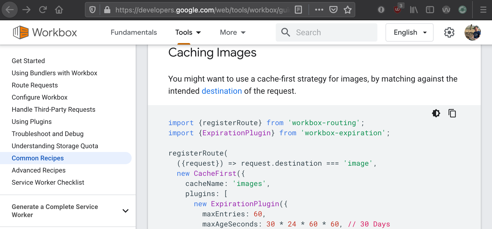

<!-- _class: lead -->
<!--
This started off as a me just messing around making my Rails apps "Progress Web App'

I ended up quite liking the results & wanted to share them!

Just an FYI! I'm going to mention a few resources in the talk, I'm going to put links to everything at the end.
-->

# Taking Rails Offline

Make your Ruby on Rails apps resilient to unreliable networks & also improve app performance.

---
<!--
This is my plan for what we'll talk about!

We have about 20 minutes! Fingers crossed!
-->

# What are we going to do?

- We're going to go through scenarios where making some data available offline is advantageous
- I'll run you through the approach
- I'll show you the libraries to help you get going quickly.
- We'll go through the gotchas & the wins

---
<!-- _class: lead -->
<!--
So where does _this_ come from!

I have a few use cases, if you've experienced this throw up some emojis:

- You go onto a train, maybe it goes underground & no network is unavailable. Then maybe you'd just want to check the news or the next train times.
- You're at home & someone on your local network eats all the bandwidth, so pages get slow.
- Website you visited quite recently just goes down

These are all problems we can mitigate against!
-->

# Why would you want to do this?

Chuck up an emoji if the scenarios I'm pitching sound familiar!

---
<!-- _class: lead -->
<!--
To do that we use bit of browser technology called a Service Worker.

It has pretty good browser support, who has heard of them?

Chuck up your emojis if you heard of them!

They landed in browsers around 2016, but they didn't make it to iOS until late 2018.
-->

# How are we going to do this?!

We're going to use Service Workers

<div class="center-contents mt-5">
  
</div>

---
<!-- _class: lead -->
<!--
You probably have not noticed them quietly running on your machine.

They pretty much are just JavaScript file we can run in the background while a user is looking at our webpage.

You can use it for a bunch of stuff, but mainly it's caching files & tampering with requests to avoid touching the network.
-->

# How are we going to do this?!

<div class="center-contents mt-8">
  
</div>

---
<!-- _class: lead -->
<!--
Lots of websites quietly use them to download CSS & JavaScript assets.

If you open the Storage tab in your dev tools, you can see what's being saved.
-->

# How are we going to do this?!

<div class="center-contents mt-8">
  
</div>

---
<!-- _class: lead -->
<!--
We're downloading a lot of files here, but they're all take 0ms...they're all coming from the service worker also.
-->

# How are we going to do this?!

<div class="center-contents mt-8">
  
</div>

---

<!-- _class: lead -->
<!--
Because all the files are cached offline, you get this happy side effect.
-->

# How are we going to do this?!

<div class="center-contents mt-2">
  
</div>

---
<!-- _class: lead -->
<!--
You can visit the debugging page in your browser & you can see them all working (along with all the ones you've collected).

When I first opened this page I found like 30 of them there.

If you smash that inspect button, you can also see their code.
-->

# How are we going to do this?!

<div class="center-contents mt-2">
  
</div>

---
<!-- _class: lead -->
<!--
Which is quite interesting to look at!

How are we feeling about Service Workers? We all understand it's javascript file we can use to tamper with requests & cache stuff?

Throw up some emojis for me!
-->

# How are we going to do this?!

<div class="center-contents mt-2">
  
</div>

---
<!--
So pretty much in a traditional request, the app will always touch the network for things like assets and new data.
-->

# In a Traditional Request

<div class="center-contents mt-12">
  
</div>

---
<!--
When we add the service worker, we can say "Actually, we've have this file - Don't touch the network".
-->

# With a Service Worker

<div class="center-contents mt-2">
  
</div>

---
<!--
What this allows is if the network is slow or not around, we can use that file we cached.
-->

# With a Service Worker

<div class="center-contents mt-2">
  
</div>

---
<!-- _class: lead -->
<!--
How are we doing for time?

How do we add this magic to rails?
-->

# Adding a Service Worker to Rails

---
<!--
We use a little bit of JavaScript to our application.js to say "If you can use run service workers, go run ours"

Then the browser will go fetch that file.
-->

# Adding a Service Worker to Rails

```javascript{4,5}
// app/assets/javascripts/application.js
if ('serviceWorker' in navigator) {
  window.addEventListener('load', function() {
    navigator.serviceWorker
      .register('/service-worker.js', { scope: "/" })
  });
}
```

---
<!--
Normally that file will look a bit like this!
-->

# Adding a Service Worker to Rails

```javascript{0}
// public/service-worker.js

self.addEventListener('install', function(event) {
  // We've been added. Pre-cache some stuff
});

// A request is being made
// Load a file from the cache, or request it from the network
self.addEventListener('fetch', function(event) {
  // return fetch(event.request);
  console.log(event);
  debugger;
});
```

---
<!--
If you're curious about writing one of these yourself have a look at:

servicewore.rs - It's a cookbook site by Mozilla.

It coverages how you'd implement strategies, e.g:

1. Downloading ahead of time
2. Asking the cache first for the file
-->

# Adding a Service Worker to Rails

<div class="center-contents pt-2">
  
</div>

---

<!--
They have a bunch of samples you can mess around with.

I did start writing a JavaScript file which should nicely for Rails for people, but then I asked the question:
-->

# Adding a Service Worker to Rails

<div class="center-contents pt-2">
  
</div>

---
<!-- _class: lead -->
<!--
Turns out awesome people have written stuff for us to use :)

Let me quickly summarise them!
-->

# Is there a Gem for this?

Yes! I found two awesome ones!

`serviceworker-rails` & `webpacker-pwa`

---

<!--
serviceworker-rails - It's the easier choice, it ships a working JS file & you will tweak it based on your needs.

webpacker-pwa - It's more complicated, but you can use a library called WorkBox to configure your caching rules.
-->

# Which gem is the best?

| serviceworker-rails                   | webpacker-pwa                                   |
|---------------------------------------|-------------------------------------------------|
| Works via the Asset Pipeline          | Works with Webpacker                            |
| One command to install                | More complex to setup                           |
| You set up an array of files to cache | Can set more complex rules for what gets cached |
| Does not support Webpacker            | Modern JS (You can use Google Workbox)          |
| Default is just an offline fallback   | Does not ship with a default file               |

---

<!--
serviceworker-rails - It's very easy to install, but limited.
-->

# serviceworker-rails

https://github.com/rossta/serviceworker-rails

```bash{0}
$ bundle add serviceworker-rails
$ rails g serviceworker:install
```

---

<!--
These are the files it adds, the only important one is serviceworker.js.erb
-->

# serviceworker-rails

```bash{8,12}
$ git status
On branch main
Changes to be committed:
  (use "git restore --staged <file>..." to unstage)
	modified:   app/assets/javascripts/application.js
	new file:   app/assets/javascripts/manifest.json.erb
	new file:   app/assets/javascripts/serviceworker-companion.js
	new file:   app/assets/javascripts/serviceworker.js.erb
	modified:   app/views/layouts/application.html.erb
	modified:   config/initializers/assets.rb
	new file:   config/initializers/serviceworker.rb
	new file:   public/offline.html
```

---

<!--
The key thing to note in that file is you list the files you'd like available offline
-->

# serviceworker-rails

```javascript{7-8}
// app/assets/javascripts/serviceworker.js.erb
function onInstall(event) {
  console.log('[Serviceworker]', "Installing!", event);
  event.waitUntil(
    caches.open(CACHE_NAME).then(function prefill(cache) {
      return cache.addAll([
        '<%= asset_path "application.css" %>',
        '/offline.html',
      ]);
    })
  );
}
```

---

<!--
Then it'll cache everything
-->

# serviceworker-rails


<div class="center-contents mt-2">
  
</div>

---

<!--
The key thing to note in that file is you list the files you'd like available offline
-->

# serviceworker-rails

```javascript{0}
// app/assets/javascripts/serviceworker.js.erb
function onFetch(event) {
  event.respondWith(fetch(event.request).catch(function() {
    return caches.match(event.request).then(function(response) {
      if (response) { return response; }

      // Fallback to offline.html
      if (event.request.mode === 'navigate') {
        return caches.match('/offline.html');
      }
    })
  }));
}
```

---

<!--
The end result is if the users networks goes down, or the users wifi goes out & the file isn't cached they see this page.

It's a nice starting point, but not amazing.
-->

# serviceworker-rails

<div class="center-contents mt-2">
  
</div>

---

<!--
Setting this one up requires a bit more setup.
-->

# webpacker-pwa 

https://github.com/coorasse/webpacker-pwa

```bash{0}
$ bundle add webpacker-pwa --group=development
$ yarn add webpacker-pwa
```

Then you'll also need to edit `config/webpack/environment.js` & `config/webpacker.yml`.

---

<!--
But you'll be able to use Google Workbox, which is like Swiss army knife for writing Service Worker JS & it not becoming a giant complex mess.
-->

<div class="center-contents pt-2">
  
</div>

---

<!--
Which is JavaScript library which has extracted lots of the complexity of writing Service Workers into something cleaner.
-->

# webpacker-pwa 

```javascript{0}
// app/javascript/service_workers/service-worker.js
import { registerRoute } from 'workbox-routing';
import { NetworkFirst, CacheFirst } from 'workbox-strategies';

registerRoute(
  ({ request }) => request.mode === 'navigate',
  new NetworkFirst({
    cacheName: 'pages',
    plugins: [],
  }),
);
```

---

<!--
And they have a pretty nifty cookbook, which should mean things are pretty standard.
-->

# webpacker-pwa 

<div class="center-contents pt-2">
  
</div>

---

<!--
But the end result for this gem was:

I had quite good performance for loading CSS/JS assets
-->

# webpacker-pwa 

<div class="center-contents pt-2">
  
</div>

---

<!--
Also without me having to explicitly predefine what I wanted offline, it had built cache of pages
which were ok to display offline.
-->

# webpacker-pwa 

<div class="center-contents pt-2">
  
</div>

---

<!--
Then once I turned my network off, my app still loaded.
-->

# webpacker-pwa 

<div class="center-contents pt-2">
  
</div>

---

<!--
- The URL having to stay the same is big hurdle. If you change the URL, you'll end up with multiple service workers running.

- I couldn't find any good documentation about how much you can store in cache, someone on StackOverflow said 25MB

- A good example for devices is iOS. I found I needed to bookmark my app on my homescreen for it to work, but on my browser is worked nicely.

- Messing with requests can backfire. I had a friend misconfigure his, and it broke form submissions in production...they didn't notice for a while.

- Not every app needs one...
-->

# The Gotchas

- URL of service worker must stay the same, e.g. `/service-worker.js`
- Cache size is pretty varied between devices, ~25MB ( https://stackoverflow.com/a/35696506/445724 ) is the maximum
- I've had one running on my local dev & a page not updating.
- It is tampering with requests, so can go wrong
- There isn't a perfect gem or configuration for Rails apps.

---

<!--
I got to talk with someone who works on the IKEA website, and they had an interesting insight.

If a user is only going to touch a few core pages a few times a year, it's not worth the effort.
-->

# Not suitable for all use apps

> Way too big a footgun for a site like IKEA in my opinion. People tend to visit less frequently and with less patterns than to, for example, a social network
>
> _Robin Whittleton, engineering manager for IKEA (His opinion, not IKEAs)_

---

<!--
- Twitter ships like 5mb of JavaScript & fonts, which is massive. But the second time you visit it, it's pretty quick to load.
- It's pretty cool to cache home pages
- Say you've got client who is complaining a single page is slow, you could pre-cache it!
- A social network in early January was able to make their feed read-only when their main site when down.
-->

# The Wins

- Cache some assets (like JavaScript & CSS) ahead of time like Twitter
- Offer a few key pages offline (e.g. top news articles)
- You can fetch slow content ahead of time
- They can can be used for background syncing
- Useful for DDoS mitigation

---
<!--
DHH says I'm cool.

He was talking about Hotwire & how Service Workers play nicely with HTML over the wire.

So maybe something is coming to Rails...
-->

<div class="center-contents">
  
</div>

---

<!-- _class: lead -->

<!--
Breath & tell them your name!

Does anyone want to see a demo?
-->

# Thank you

Twitter: @MikeRogers0

Blog: [mikerogers.io](https://mikerogers.io/)
