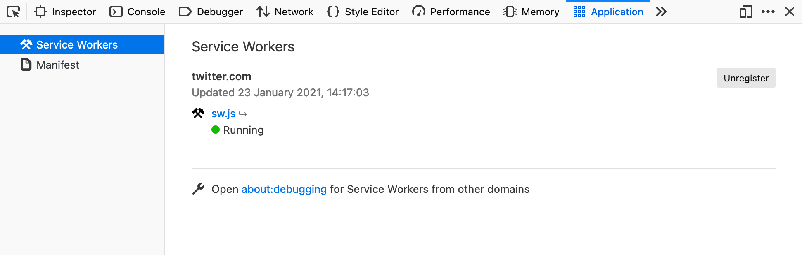

<!-- _class: lead -->
<!--
This started off as a me just messing around making my Rails apps "Progress Web App'

I ended up quite liking the results & wanted to share them!
-->

# Taking Rails Offline

Make your Ruby on Rails apps resilient to unreliable networks & also improve app performance.

---
<!--
This is my plan for what we'll talk about!

We have about 15 minutes! Fingers crossed!
-->

# What are we going to do?

- We're going to go through scenarios where making some data available offline is advantageous
- I'll run you through the approach
- I'll show you the libraries to help you get going quickly.
- We'll go through the gotchas & the wins

---
<!-- _class: lead -->
<!--
So where does _this_ come from!

I have a few use cases, if you've experienced this throw up some emojis:

- You go onto a train, maybe it goes underground & no network is unavailable. Then maybe you'd just want to check the news or the next train times.
- You're at home & someone on your local network eats all the bandwidth, so pages get slow.
- Website you visited quite recently just goes down

These are all problems we can mitigate against!
-->

# Why would you want to do this?

Chuck up an emoji if the scenarios I'm pitching sound familiar!

---
<!-- _class: lead -->
<!--
To do that we use bit of browser technology called a Service Worker.

It has pretty good browser support, who has heard of them?

Chuck up your emojis if you heard of them!

They landed in browsers around 2016, but they didn't make it to iOS until late 2018.
-->

# How are we going to do this?!

We're going to use Service Workers

<div class="center-contents mt-5">
  
</div>

---
<!-- _class: lead -->
<!--
You probably have not noticed them quietly running on your machine.

They pretty much are just JavaScript file we can run in the background while a user is looking at our webpage.

You can use it for a bunch of stuff, but mainly it's caching files & tampering with requests to avoid touching the network.
-->

# How are we going to do this?!

<div class="center-contents mt-8">
  
</div>

---
<!-- _class: lead -->
<!--
Lots of websites quietly use them to download CSS & JavaScript assets.

If you open the Storage tab in your dev tools, you can see what's being saved.
-->

# How are we going to do this?!

<div class="center-contents mt-8">
  
</div>

---
<!-- _class: lead -->
<!--

-->

# How are we going to do this?!

<div class="center-contents mt-8">
  
</div>

---
<!-- _class: lead -->
<!--
You can visit the debugging page in your browser & you can see them all working (along with all the ones you've collected).

When I first opened this page I found like 30 of them there.

If you smash that inspect button, you can also see their code.
-->

# How are we going to do this?!

<div class="center-contents mt-2">
  
</div>

---
<!-- _class: lead -->
<!--
Which is quite interesting to look at!

How are we feeling about Service Workers? We all understand it's javascript file we can use to tamper with requests & cache stuff?

Throw up some emojis for me!
-->

# How are we going to do this?!

<div class="center-contents mt-2">
  
</div>

---
<!--
So pretty much in a traditional request, the app will always touch the network for things like assets and new data.
-->

# In a Traditional Request

<div class="center-contents mt-12">
  
</div>

---
<!--
When we add the service worker, we can say "Actually, we've have this file - Don't touch the network".
-->

# With a Service Worker

<div class="center-contents mt-2">
  
</div>

---
<!--
What this allows is if the network is slow or not around, we can use that file we cached.
-->

# With a Service Worker

<div class="center-contents mt-2">
  
</div>

---
<!-- _class: lead -->
<!--
How are we doing for time?

How do we add this magic to rails?
-->

# Adding a Service Worker to Rails

---
<!--
We use a little bit of JavaScript to our application.js to say "If you can use run service workers, go run ours"

Then the browser will go fetch that file.
-->

# Adding a Service Worker to Rails

```javascript{4,5}
// app/assets/javascripts/application.js
if ('serviceWorker' in navigator) {
  window.addEventListener('load', function() {
    navigator.serviceWorker
      .register('/service-worker.js', { scope: "/" })
  });
}
```

---
<!--
Normally that file will look a bit like this!

However, this is JavaScript & this is Ruby group! So...
-->

# Adding a Service Worker to Rails

```javascript
// public/service-worker.js

// Service Worker was added by the browser
self.addEventListener('install', function(event) {
  // Cache some files
});

// A request is being made
// Load a file from the cache, or request it from the network
self.addEventListener('fetch', function(event) {
  // return fetch(event.request);
  console.log(event);
  debugger;
});
```

---
<!--
If you're curious about writing one of these yourself have a look at:

servicewore.rs - It's a cookbook site by Mozilla.

It coverages how you'd implement strategies, e.g:

1. Downloading ahead of time
2. Asking the cache first for the file
-->

# Adding a Service Worker to Rails

<div class="center-contents pt-2">
  
</div>

---

<!--
They have a bunch of samples you can mess around with.

I did start writing a JavaScript file which should nicely for Rails for people, but then I asked the question:
-->

# Adding a Service Worker to Rails

<div class="center-contents pt-2">
  
</div>

---
<!-- _class: lead -->
<!--
Turns out awesome people have written stuff for us to use :)
-->

# Is there a Gem for this?

Yes! I found two awesome ones!

`serviceworker-rails` & `webpacker-pwa`

---

<!--
-->

# serviceworker-rails

```bash
$ bundle add serviceworker-rails --group=development
$ rails g serviceworker:install
```

- Works via the Asset Pipeline
- You predefine the assets you want to have cached and available offline
- If you're app goes offline, it'll fallback if it doesn't have the file cached.

---

<!--
-->

# serviceworker-rails

```bash
On branch main
Changes to be committed:
  (use "git restore --staged <file>..." to unstage)
	modified:   app/assets/javascripts/application.js
	new file:   app/assets/javascripts/manifest.json.erb
	new file:   app/assets/javascripts/serviceworker-companion.js
	new file:   app/assets/javascripts/serviceworker.js.erb
	modified:   app/views/layouts/application.html.erb
	modified:   config/initializers/assets.rb
	new file:   config/initializers/serviceworker.rb
	new file:   public/offline.html
```

---

# Installing with Gem

- Go through files, show it working

---

# Demo of Gem

---

# Installing the Webpacker gem

https://github.com/coorasse/webpacker-pwa

- Awesome because it lets you use Modern JS with Webpacker
- Trickier to get setup
- Lets you work a Library from google called Workbox, which is easier to configure

---

# Installing the Webpacker gem

```javascript
// app/javascript/service_workers/service-worker.js
import { registerRoute } from 'workbox-routing';
import { NetworkFirst, StaleWhileRevalidate, CacheFirst } from 'workbox-strategies';
import { CacheableResponsePlugin } from 'workbox-cacheable-response';

registerRoute(
  ({ request }) => request.mode === 'navigate',
  new NetworkFirst({
    cacheName: 'pages',
    plugins: [
      new CacheableResponsePlugin({
        statuses: [200],
      }),
    ],
  }),
);
```

---

# Installing the Webpacker gem

```javascript
// app/javascript/service_workers/service-worker.js
import { registerRoute } from 'workbox-routing';
import { NetworkFirst, StaleWhileRevalidate, CacheFirst } from 'workbox-strategies';
import { CacheableResponsePlugin } from 'workbox-cacheable-response';

registerRoute(
  ({ request }) => request.mode === 'style',
  new CacheFirst({
    cacheName: 'css-files',
    plugins: [
      new CacheableResponsePlugin({
        statuses: [200],
      }),
    ],
  }),
);
```

---

# Demo of Webpacker Gem

---

<!--
I got to talk with someone who works on the IKEA website, and they had an interesting insight.

Pretty much, if your site doesn't get much traffic it's not worth it.
-->

# How should you use it?

> Way too big a footgun for a site like IKEA in my opinion. We don’t have the appshell model, and people tend to visit a few times a year rather than monthly to yearly.
>
> _Robin Whittleton, engineering manager for IKEA (His opinion, not IKEAs)_

---

<!--
This is a good use case for it.
-->

# How should you use it?

But Twitter uses it to cache some assets (like JavaScript) ahead of time

---

# Gotchas

- URL of service worker must stay the same, e.g. `/service-worker.js`
- If you're using webpacker-dev-server, it will give you a hard time.
- ~25MB limit ( https://stackoverflow.com/a/35696506/445724 )

---

# Notes

- https://github.com/rossta/serviceworker-rails
- https://developers.google.com/web/fundamentals/primers/service-workers
- https://developers.google.com/web/tools/workbox/guides/advanced-recipes
- https://developers.google.com/web/ilt/pwa/caching-files-with-service-worker
- https://developers.google.com/web/fundamentals/primers/service-workers/lifecycle#avoid-url-change
- https://dev.to/coorasse/the-progressive-rails-app-46ma
- https://developers.google.com/web/tools/workbox/modules/workbox-webpack-plugin
- https://github.com/coorasse/webpacker-pwa
- https://www.youtube.com/watch?v=RJZbWw5GEfU
- https://serviceworke.rs/strategy-network-or-cache.html
