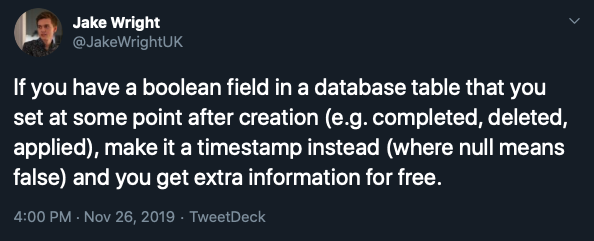

# What are we going to do?

- We're going to be looking at ActiveRecord::Events
- I'm going to show you how to setup & use this gem
- You're going to see how much of a time saver this gem is!

---
<!-- _class: lead -->

# ActiveRecord::Events

Manage timestamps in ActiveRecord models

---
<!-- footer: https://twitter.com/JakeWrightUK/status/1199357199950241792 -->
<!--
It's a good pattern to store boolean fields as timestamps. Not only do you know if something is true, you know when it was set to be true.

Tweet by Jake Wright
Backend engineer at monzo
-->

# What Are We Trying To Solve?

<div align="center" style="margin-top: 4rem;">

[](https://twitter.com/JakeWrightUK/status/1199357199950241792)

</div>

---
<!-- footer: "" -->
<!--
However this can lead to code where we repeat code which does the same kind of things. 
-->

# What Are We Trying To Solve?

```ruby
class Task < ApplicationRecord
  def completed?
    completed_at.present?
  end

  def complete!
    touch(:completed_at)
  end

  def started?
    started_at.present?
  end
end
```

---
<!--
It may also lead to a scenario where some methods are defined but others aren't.
-->

# What Are We Trying To Solve?

```ruby
task = Task.last
task.started?

# I now expect this method to be present
task.start!

# NoMethod error? What!
```

---
<!--
The ActiveRecord::Events it'll give us a nice helper, that'll generate those handy methods consistently
-->

# What Are We Trying To Solve?

```ruby
class Task < ApplicationRecord
  has_event :complete

  # We now have the instance methods:
  # Task#completed?
  # Task#complete!
  #
  # Along with the class method:
  # Task::complete_all
  #
  # And the scopes:
  # Task::completed
  # Task::not_completed
end
```

---

# Installing

Add to Gemfile:

```bash
$ bundle add active_record-events
```

---

# Generate the Migration

```bash
$ rails generate active_record:event task complete
```

---
<!--
-->

# Resources

- https://github.com/pienkowb/active_record-events

---

<!-- _class: lead -->


# Questions?

[MikeRogers.io](https://mikerogers.io/)
@MikeRogers0 on Twitter
